# Лабораторная работа №6

---

## Система контроля версий

---

### Цель лабораторной работы: изучение базовых возможностей системы управления версиями, опыт работы с Git Api, опыт работы с локальным и удаленным репозиторием.

---

### Ход работы

#### 1. Создал аккаунт на GitHub.

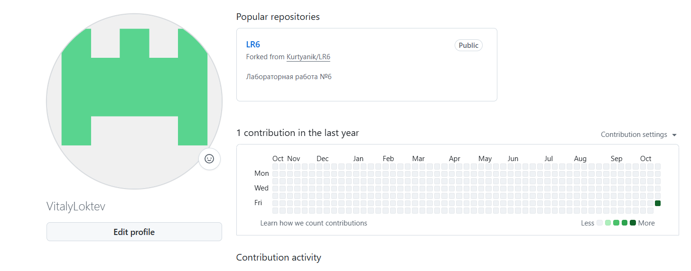

#### 2. Сделал копию в личное хранилище.

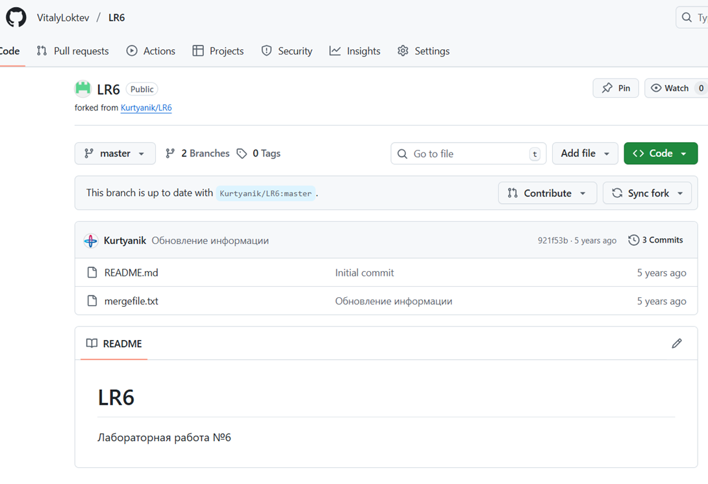

#### 3. Установил Git.

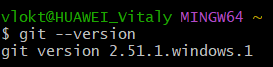

#### 4. Настроил клиент git, введя имя пользователя и email.

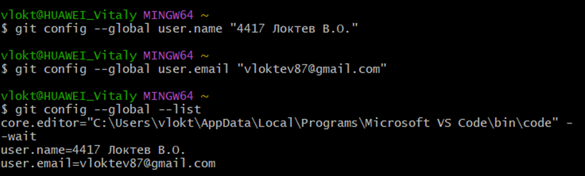

#### 5. Клонировал свой личный удалённый репозиторий на компьютер.

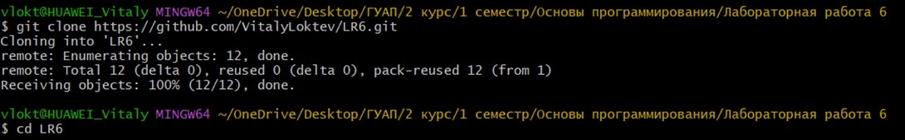

#### 6. Добавил файл через интерфейс GitHub.

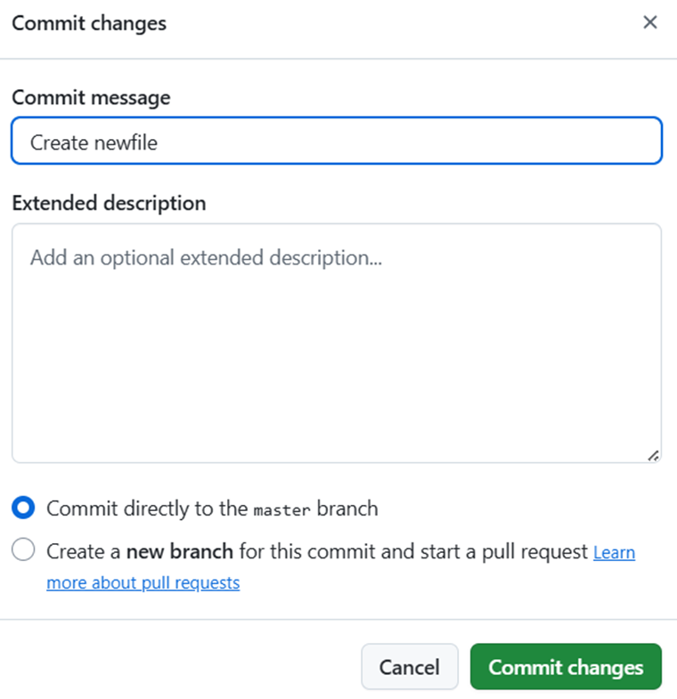

#### Далее подтянул изменения в локальный репозиторий.

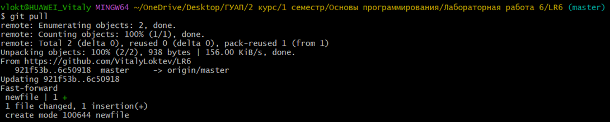

#### 7. Получил историю операций для каждой из веток.

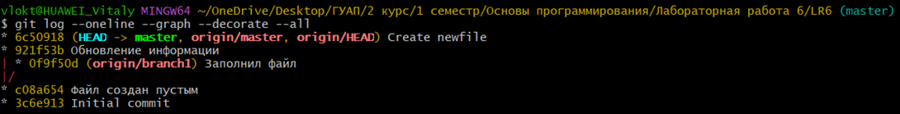

#### 8. Посмотрел последние изменения.

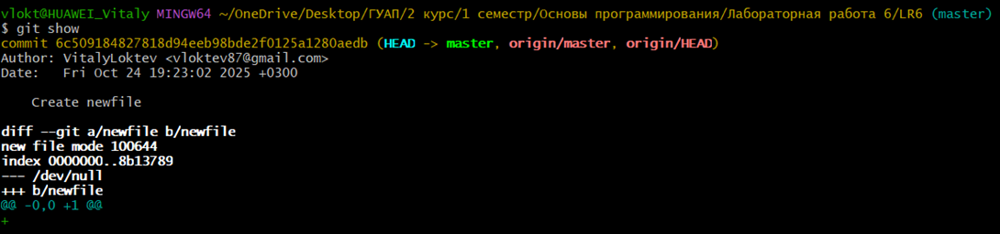

#### 9. При выполнении слияния ветки branch1 в master возник конфликт в файле mergefile.txt, так как в обеих ветках были изменены одни и те же строки; конфликт был разрешен вручную путем редактирования файла с удалением маркеров конфликта и сохранением объединенной версии содержимого, после чего изменения были зафиксированы коммитом слияния.

#### 10. Снова получил историю операций для каждой из веток (для проверки). Далее удалил побочную ветку после слияния.

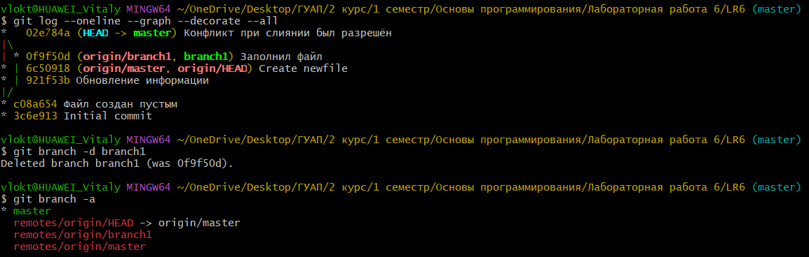

#### 11. Сделал первое изменение файла и зафиксировал его.

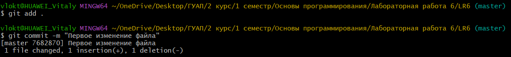

#### Далее сделал второе изменение файла, зафиксировав его.

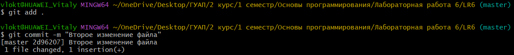

#### В конце показал содержимое файла для проверки.

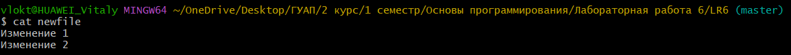

#### 12. Сделал откат коммита.

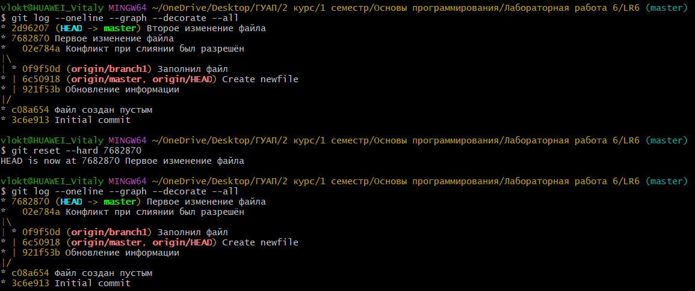

#### 13. Создал ветку для отчёта.

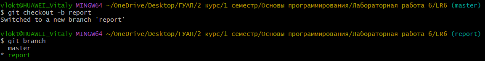

#### 14. Получил историю операция в форматированном виде.

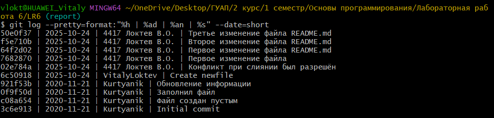

---

### Вывод

#### Изучил базовые возможности системы управления версиями, опыт работы с Git Api, опыт работы с локальным и удаленным репозиторием.